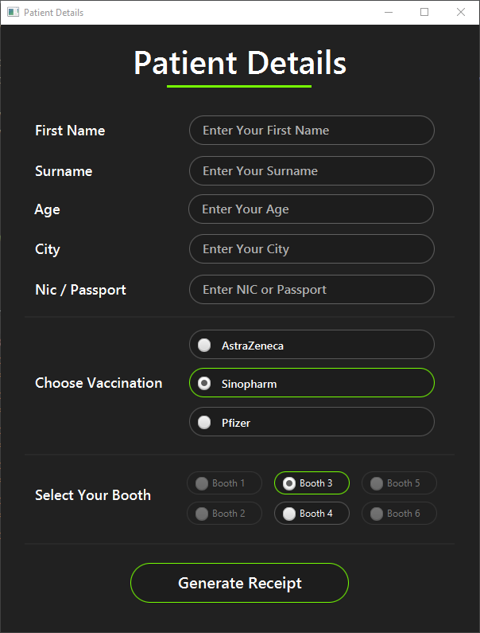
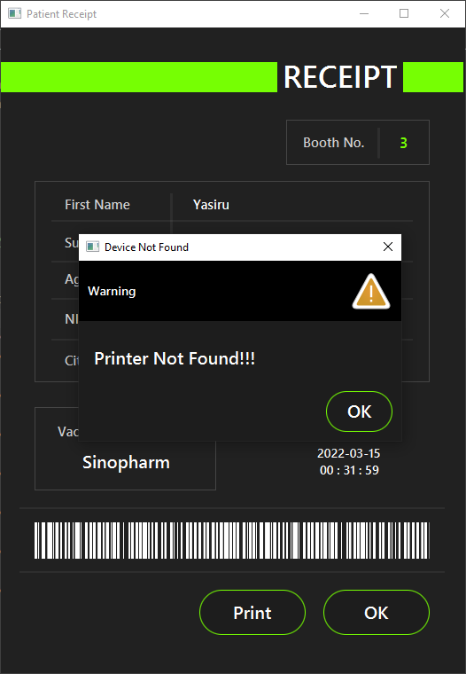

# Covid-19-Vaccination-Centre-Program
This entire application is written in Java. There is a java array version, a java class version, and a java linked list version of this application.

It also offers a JavaFx-based graphical user interface.

## Patient Details (GUI)

! [Patient Detail Form](JavaFx1.PNG)
! [Generated Receipt](JavaFx2.PNG)
! [Printer Not Found Warning](JavaFx3.PNG)

 
